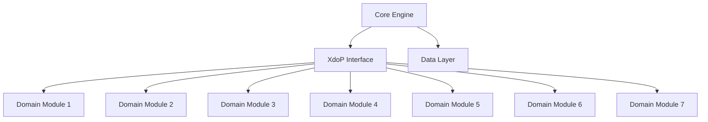

# PodX System Architecture

## High-Level Design

PodX is built on a modular architecture designed to support high-throughput Antigravity computations.

## Components

### Core Engine

The central processing unit that manages state and orchestration.

### XdoP Interface

Handles compliance and communication across the 7 XdoP domains.

### Data Layer

Manages persistence and retrieval of simulation data.
